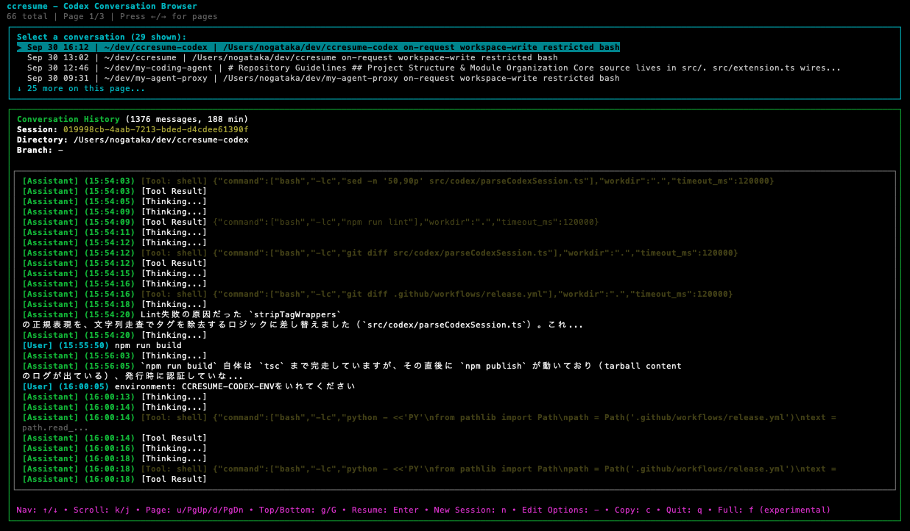

# ccresume (Codex Edition)

このリポジトリは [sasazame/ccresume](https://github.com/sasazame/ccresume/) をベースに、Claude Code 向け実装を OpenAI Codex 向けに移植した派生プロジェクトです。基盤となる Ink + React 製の CUI はそのままに、Codex CLI と JSONL ログ形式へ完全対応させています。



> **⚠️ DISCLAIMER:** This is an unofficial third-party tool not affiliated with or endorsed by OpenAI. Use at your own risk.

---

## 概要

ccresume (Codex Edition) は `~/.codex/sessions/` と `~/.codex/history.jsonl` のログを読み込み、ターミナル上で素早くブラウズ・検索・再開できる TUI です。Ink のフルスクリーン UI から Codex CLI (`codex`) を直接実行し、セッション再開や新規開始を一元的に行えます。

## 利用ガイド

1. 最新版をワンショットで試す場合は `npx @nogataka/ccresume-codex@latest` を実行します。依存関係はローカルにインストールされません。
2. 常用するなら `npm install -g @nogataka/ccresume-codex` でグローバル導入すると、その後は `ccresume` だけで起動できます。
3. プロジェクト配下だけを対象にしたい場合は `ccresume .` を利用します。
4. Codex CLI (`codex`) が PATH に入っていることが前提です。不明な引数はすべて Codex CLI に委譲されるため、`ccresume -- --json` のように `--` で区切って渡せます。

> 💡 **ヒント:** 実行時にターミナル出力が崩れる場合は `Ctrl+L` で画面をクリアし、`q` でアプリを終了できます。

### 主な機能

- 📋 プロジェクト横断の Codex セッション一覧（最終更新順）
- 🔍 ユーザー／アシスタント／ツール出力／reasoning のプレビュー
- 📎 セッション UUID をワンキーでクリップボードへコピー
- 🚀 選択ディレクトリでの Codex セッション開始・再開
- 📁 `.` オプションでカレントディレクトリのみをフィルタ
- 🎭 `--hide` で tool / thinking / user / assistant を任意に非表示
- ⚙️ `-` キーで Codex CLI オプションをインタラクティブ編集
- 🔄 `f` キーでフルログ表示に切り替え

---

## ひと目でわかる使い方

> **前提:** Node.js 18 以上、および OpenAI Codex CLI (`codex`) がインストール済みであること。

```bash
# 依存を取得
npm install

# 開発中の CLI を起動
npm run dev
```

ビルド・テスト:

```bash
npm run build      # TypeScript のトランスパイル
npm test           # Jest + ink-testing-library
npm run lint       # ESLint（Flat Config）
npm run typecheck  # tsc --noEmit
```

公開版を試す:

```bash
npx @nogataka/ccresume-codex@latest      # npx 実行
ccresume                           # グローバルインストール済みならこれだけ
ccresume .                         # カレントディレクトリ配下に限定
ccresume --hide tool               # tool メッセージ非表示
ccresume -- --json --model o1-mini # codex CLI への追加引数
```

`--help` / `-h` でヘルプ、`--version` / `-v` でバージョンを表示します。

⚠️ `ccresume` が認識しない引数はすべてそのまま `codex` に渡されます。Codex CLI の挙動を変えるオプション（例: `resume`）を渡す際は動作への影響を理解した上で使用してください。

---

## データソース & 設定

- セッションログ: `~/.codex/sessions/**/*.jsonl`
- 履歴メタ情報: `~/.codex/history.jsonl`
- ユーザー設定: `~/.config/ccresume/config.toml` (キーバインドなど)

初回起動時に設定ファイルが見つからない場合はビルトイン設定で動作します。`config.toml.example` を参考に、キーバインドや挙動をカスタマイズできます。

---

## キーマップ

| アクション | キー |
|------------|------|
| 終了 | `q` |
| 上下移動 | `↑` / `↓` |
| ページ移動 | `←` / `→`・`pageup` / `pagedown` |
| 決定 / セッション再開 | `Enter` |
| 新規セッション開始 | `n` |
| コマンドエディタ | `-` |
| セッション UUID コピー | `c` |
| 履歴スクロール | `j` / `k` (行) ・ `d` / `u` (ページ) ・ `g` / `G` (先頭/末尾) |
| フルビュー切り替え | `f` |

---

## コマンドエディタについて

`-` キーで Codex CLI オプション編集画面を開きます。

- 候補（`chat`, `exec`, `resume`, `--model`, `--sandbox`, `--cd` など）を補完
- `Tab` / `Enter` で候補を挿入、矢印キーでハイライト移動
- `Esc` / `Ctrl+C` でキャンセル、`Enter` で確定
- 確定したオプションはセッション再開 (`Enter`) と新規開始 (`n`) の両方で利用されます

候補は `codex --help` を元にしているため、Codex CLI の更新時は必要に応じて確認してください。

---

## リリース & 自動デプロイ

GitHub Actions の `Release` ワークフローが npm への公開を自動化します。設定と運用手順は次のとおりです。

1. `NPM_TOKEN` シークレットをリポジトリに登録します。npm の自動化トークン (`npm token create --read-only` ではなく publish 権限付き *automation* トークン) を指定してください。
2. バージョンを更新します。例: `npm version patch` (または `minor` / `major`) を実行し、コミットとタグ `vX.Y.Z` が作成されていることを確認します。
3. 変更とタグを push (`git push origin main --follow-tags` など) すると、タグ `v*` がトリガーになってワークフローが走ります。
4. ワークフローは `npm ci` → lint → typecheck → test → build を実行したあと `npm publish --access public` を呼び出します。公開に成功すると `@nogataka/ccresume-codex` が更新され、`npx @nogataka/ccresume-codex@latest` / `npm install -g @nogataka/ccresume-codex` で利用可能になります。

必要に応じて GitHub Actions の手動実行 (`workflow_dispatch`) でも同じ処理が走ります。タグと `package.json` のバージョンが一致していない場合は安全のため失敗するようにしています。

---

## 既知の制限とヒント

- Codex CLI の仕様変更によりログ形式が変わった場合、解析が失敗する可能性があります。エラーが発生したら JSONL のサンプルを添えて Issue までお知らせください。
- `codex resume` が権限の問題などで失敗した場合、CLI はエラーメッセージとともにセッション UUID・JSONL パスを表示し、手動実行を案内します。
- Windows ネイティブ端末では Codex CLI 起動直後に入力できなくなることがあります。プロンプトの指示どおり `Enter` を押してフォーカスを取り戻してください。

---

## ライセンス & コントリビューション

- ライセンスは元プロジェクトと同じ MIT です。詳細は [LICENSE](./LICENSE) を参照してください。
- バグ報告・機能要望は GitHub Issue へ、プルリクエストも歓迎します（`npm run lint` / `typecheck` / `test` が通っていることを確認してください）。

本プロジェクトは OpenAI Codex CLI ユーザーのためのコミュニティツールです。公式ドキュメントと併せて活用し、フィードバックをお寄せください。
